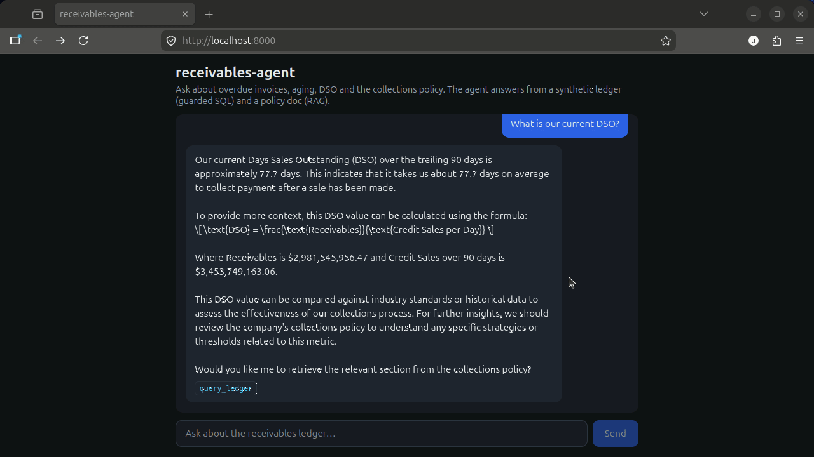

<p align="center">
  
</p>

<h1 align="center">receivables-agent</h1>

<p align="center"><em>Ask your receivables ledger a plain-language question — get the prioritized accounts <strong>and</strong> the governing policy, cited.</em></p>

<p align="center">
  <a href="https://jorgeed-receivables-agent.hf.space"></a>
  
  
  
  
  <a href="LICENSE"></a>
</p>

<p align="center">
  <strong>🚀 Try it live:</strong>
  <a href="https://jorgeed-receivables-agent.hf.space">jorgeed-receivables-agent.hf.space</a>
  — a self-contained Hugging Face Space running a <strong>tiny local model</strong>
  (no API key, 100% synthetic data). The one-click example questions answer
  instantly (cached plans, re-run live); a typed question runs the tiny model on a
  free CPU, so it's slower — that's the <em>"shines with a better model"</em> story,
  by design.
</p>

**Collections teams burn hours on two questions every day: _who do we chase
first_, and _what does our policy allow?_** Answering them today means writing
SQL against the ledger *and* digging through a policy document — for every
account, every week.

`receivables-agent` answers both in plain language. Ask *"which overdue accounts
above $50k should go on credit hold this week, and what's the rule?"* and it
returns the **prioritized accounts** (from the ledger) **with the governing
policy, cited** — turning an analyst's afternoon of SQL and PDF-hunting into one
question. Under the hood it's a ReAct agent that combines a **guarded
text-to-SQL tool** over the ledger with **retrieval over the collections
policy**.

> **Status: shipped + live.** The agent, the guarded SQL + RAG tools, the FastAPI
> service (with **live SSE streaming** — watch the agent think), the React UI, the
> one-command Docker run, the AI-native layer (MCP server + eval suite), a
> **semantic plan-cache**, **hardware-aware / grammar-constrained** local models and
> **graceful degradation at the step ceiling** (dedup + forced finalization +
> narration) are all implemented and tested (**135 tests**), and the whole thing is
> **deployed to a free, self-contained Hugging Face Space** running a tiny local model
> (no API key). A public, clean-room portfolio project on 100% synthetic data. See
> [`PLAN.md`](PLAN.md) for the roadmap, [`docs/DEPLOY.md`](docs/DEPLOY.md) for the
> live deploy, and [`docs/STATE.md`](docs/STATE.md) for current progress.



*One plain-language question → the agent runs **guarded SQL** over the ledger and
**retrieves the governing policy**, then answers with the prioritized accounts
*and* the cited rule. The `tools_used` badge shows which tools each answer hit.
Recorded against a local Ollama model (`qwen2.5:7b`); a `GEMINI_API_KEY` works
the same way.*

### 🚀 Try it live

**[jorgeed-receivables-agent.hf.space](https://jorgeed-receivables-agent.hf.space)** — a
self-contained Hugging Face Space that runs its **own tiny local model** (no API key, 100%
synthetic data). The one-click **example questions answer instantly** (pre-computed *plans*
that are re-run live against the ledger, so the numbers are always current); a **typed**
question runs the tiny model on a free CPU, so it's slower — the UI streams the agent's steps
live and shows an elapsed timer so you can watch it think. That slowness is the honest
free-tier floor: the *architecture* (governed text-to-SQL + RAG) is the product — point it at
a stronger model and the same code shines. The UI ships a **light/dark theme** (follows your
OS, with a manual toggle) and an **EN/PT-BR** language switch — note the interface is
localized, but the agent's answers come from the model and the English policy corpus, so they
are not machine-translated. See [`docs/DEPLOY.md`](docs/DEPLOY.md).

## What it does

Ask things like *"Which overdue invoices above $50k should we prioritize this
week, and what does our policy say about offering a payment plan?"* The agent:

1. Plans which tools to call (a ReAct loop on LangGraph).
2. Queries the receivables ledger through a **read-only, allow-listed SQL tool**
   (defense in depth: the model can never mutate or escape the database).
3. Retrieves relevant rules from a **collections-policy knowledge base** (RAG).
4. Answers in natural language, grounded in both sources.

## Example

> The figures below are **real** — queried live from the synthetic ledger — and
> the policy reference is the actual section in
> [`data/collections_policy.md`](data/collections_policy.md). The agent's exact
> wording is produced by the LLM at run time; this shows the shape of an answer.

**Question**

> Which overdue accounts above $50k should go on credit hold this week, and what
> policy governs that decision?

**Agent answer**

> **2,719** accounts are overdue above $50k and 60+ days past due. Per the
> *Credit holds* policy, an account goes on hold once an invoice is **60+ days
> past due** without a payment commitment (or the balance exceeds the credit
> limit). Working highest-risk first (the *Prioritisation* rule — 90+ bucket
> above $50k), the top accounts are:
>
> 1. **Hensley-Huang** (enterprise) — ~$10.07M overdue, 186 days past due
> 2. **Serrano-Jenkins** (enterprise) — ~$8.74M overdue, 247 days past due
> 3. **Sanders-Banks** (enterprise) — ~$8.36M overdue, 655 days past due
>
> Source: *Credit holds* and *Prioritisation rules* sections of the collections
> policy.

**Tools used:** `query_ledger` (guarded SQL over the ledger) ·
`search_policy` (retrieval over the collections policy)

## The data (and why it's realistic)

100% generated locally (Faker for the customer dimension + **set-based DuckDB**
for the facts), so the project is clean-room and the figures are reproducible
from a fixed seed:

| Metric | Value |
| --- | ---: |
| Invoices | 1,057,402 |
| Payments | 923,200 |
| Dunning communications | 304,773 |
| Customers | 13,000 |
| Aging buckets | 5 — current / 1–30 / 31–60 / 61–90 / 90+ |
| Reporting (as-of) date | 2026-06-30 |

It carries **signal, not noise.** Every customer gets a payment-behaviour
profile that drives a realistic overdue rate, so aging and DSO are meaningful and
the agent can actually find the slow payers:

| Behaviour profile | Overdue rate |
| --- | ---: |
| prompt | 0.5% |
| reliable | 1.7% |
| slow | 7.5% |
| delinquent | 19.1% |
| defaulter | 49.6% |

On this ledger that totals **~$1.47B overdue out of ~$2.98B outstanding**, with a
trailing-90-day **DSO ≈ 78 days** — the kind of numbers the agent computes on
demand from natural-language questions.

## Architecture

```
(synthetic data) ──► DuckDB ledger
                          │
(collections policy) ─► ChromaDB (RAG)
                          │
                LangGraph ReAct agent
        guarded text-to-SQL  +  policy retrieval
        dual-provider LLM (cloud / local) with fallback
                          │
                   FastAPI service
                          │
                    React chat UI
```

See [`docs/ARCHITECTURE.md`](docs/ARCHITECTURE.md) for detail.

## Tech stack

- **Agent:** LangGraph (ReAct), dual LLM provider with active fallback
- **Data:** synthetic generator (Faker + DuckDB), ~1M+ invoices
- **Retrieval:** ChromaDB, idempotent indexing
- **API:** FastAPI (async lifespan, API-key auth, Pydantic v2)
- **Web:** React chat UI
- **Tooling:** Docker / Compose, pytest, an MCP server, a Claude Code skill

## Run

### One command (Docker)

```bash
cp .env.example .env          # then set GEMINI_API_KEY (and APP_API_KEY) in .env
docker compose up --build
```

Open <http://localhost:8000>. The image builds the React UI, installs the API,
**generates the synthetic ledger at build time**, and serves the UI + API from a
single container. The demo uses the cloud provider (Gemini); set `GEMINI_API_KEY`
in `.env`. `APP_API_KEY` guards the API and is baked into the UI build so the
same-origin browser can authenticate (keep the two equal).

### Local dev (two processes)

```bash
# 1) API — Ollama primary by default (run `ollama serve` + pull a tool model),
#    or set PRIMARY_PROVIDER=gemini + GEMINI_API_KEY in .env.
pip install -e ".[ollama,gemini,data,dev]"
python data/generate.py                       # build data/ledger.duckdb once
uvicorn src.api.app:app --reload              # http://localhost:8000

# 2) Web — Vite dev server, proxies /api to the API above.
cd web && npm install && npm run dev          # http://localhost:5173
```

### API

- `GET /api/health` — liveness + whether the agent is built (open, no key).
- `POST /api/chat` — `{ "message": "...", "history": [...] }` with an
  `X-API-Key` header → `{ "reply": "...", "tools_used": ["query_ledger", ...] }`.
  Interactive docs at `/docs`.

### Tests

```bash
pip install -e ".[dev]"
pytest            # offline: SQL guardrail, RAG, API, MCP, evals, plan-cache, turn-control (135 tests)
```

## AI-native layer

Beyond the app, the ledger and the agent are built to be *operated by other AI
tools* — the surface AI-native teams care about:

- **MCP server** ([`mcp_server/`](mcp_server/)) — exposes the ledger to any MCP
  (Model Context Protocol) client (Claude Code, Claude Desktop, other agents) as
  a `query_ledger` tool, running the **same read-only guardrail** as the app, so
  a new surface is never a weaker one. `python -m mcp_server.server`.
- **Eval suite** ([`evals/`](evals/)) — golden questions scored by *properties*
  (used the right tool, cited the policy keyword, stated the right number within
  tolerance) rather than brittle string matching; numeric expectations are
  computed from the ledger. `python -m evals.run` gates a regression with a
  non-zero exit. The pure checks are unit-tested offline.
- **Claude Code skill** ([`.claude/skills/eval-agent/`](.claude/skills/eval-agent/))
  + [`CLAUDE.md`](CLAUDE.md) — the conventions and the eval-runner skill that let
  an AI collaborator work in this repo productively.

## Semantic plan-cache (cache the *plan*, never the answer)

On a small/free model the LLM is the slow part of a turn, and demo visitors ask
overlapping questions. A naive answer-cache would be *fast but wrong*: a frozen
number lies the moment the ledger changes. So this caches the question →
**plan** — the agent's guard-validated tool calls (which SQL, which policy
lookup) — and **re-executes it live** on every hit:

- A semantically similar question **hits** the cache (cosine similarity over the
  same local MiniLM embeddings the RAG index uses — no new dependency).
- On a hit the cached SQL is **re-validated through the guardrail and run
  read-only again**, so the number always reflects the *current* data; only the
  LLM's reasoning is skipped. Regenerate the ledger and the answer updates.
- Only **read-only, guard-valid** plans are ever cached; a conservative
  similarity threshold means a miss simply falls through to the LLM.

It's caching the *reasoning*, not the output — a fast path that can't go stale.
See [ADR-009](docs/DECISIONS.md) and
[`tests/test_plan_cache.py`](tests/test_plan_cache.py) (the freshness test mutates
the ledger and proves the replayed number moves).

## Runs on the box it's given (tiny model → strong model, no reconfig)

The same code should scale from a free CPU tier to a workstation with a GPU
without hand-tuning. Two pieces make the local path do that automatically:

- **Hardware-aware model selection** ([`src/core/hardware.py`](src/core/hardware.py),
  [ADR-010](docs/DECISIONS.md)). `OLLAMA_MODEL=auto` detects RAM / VRAM
  (`nvidia-smi`) / CPU, computes an *effective memory* budget (VRAM on a GPU box,
  else ~80% of RAM) and picks the best-fitting **already-downloaded** model from a
  public catalog. `python -m src.core.hardware` prints the pick for your machine;
  `--select` emits an `OLLAMA_MODEL=…` line a container entrypoint can consume. No
  new dependency — psutil is optional, with stdlib fallbacks.
- **Grammar-constrained tool-calls for tiny models**
  ([`src/agent/constrained.py`](src/agent/constrained.py), [ADR-011](docs/DECISIONS.md)).
  A 0.5–1.5B model can't tool-call natively — *measured*, not assumed: one emits
  valid JSON but invents argument fields and omits the real `sql`; another writes
  correct SQL in prose and emits no tool call at all. So the local model's reply is
  constrained to a `{tool, sql|query, answer}` schema (Ollama's `format`, a GBNF
  grammar underneath) and translated back into `tool_calls`. Measured across the
  golden questions this moves both tiny models from ≤1/5 to 5/5 well-formed calls.
  It's **tier-gated** (reusing the hardware catalog): tiny models get the shim,
  stronger models keep native tool-calling — constraining a capable model would
  only hold it back. `format` fixes the *structure*; SQL *quality* still scales
  with the model — which is the whole point: the architecture is reliable at 0.5B,
  and it *shines with a better model*.

## Graceful degradation at the step ceiling

A tiny model on a free CPU sometimes over-thinks a novel question — re-calling a
tool it already ran, or burning its step budget without converging. The failure
mode to avoid is the worst first impression: hitting the ceiling and dead-ending
on a generic apology that *reads as "I just don't work."* Four seams
([`src/agent/turn_control.py`](src/agent/turn_control.py), [ADR-014](docs/DECISIONS.md))
make it degrade gracefully instead:

- **Redundant-call dedup.** An identical tool call within a turn is served from a
  per-turn memo with a firm nudge, never re-executed — *not a bigger budget, just
  not squandering the budget it has.* (Turn state lives in a `ContextVar`, so the
  one process-wide agent stays concurrency-safe.)
- **Forced finalization.** If the loop still hits the ceiling, the agent answers
  from **what it actually gathered** — the latest successful ledger query, a policy
  finding, and the specific gap plus a narrowed next step ("I pulled the overdue
  list but didn't rank it — ask me to sort by amount") — composed deterministically,
  never a fabricated number, instead of the canned apology.
- **Progress narration.** Each step streams a human line ("checking the collections
  policy on…" → "found 12 rows in the ledger"), so a longer run is *visible and
  productive*, not a frozen spinner.
- **One cap split into two guards.** Narration makes a longer wait tolerable, so the
  *silent* path keeps a tight step cap while the *narrated* streaming path gets a
  higher cap **plus a soft wall-clock budget** — a loop guard (steps) and a wait
  guard (seconds), instead of one number doing both jobs badly. The cap only rises
  *because* it ships with dedup + finalization + narration; raising it alone would
  just recreate a silent thrash.

## How this was built

I architect and review every line; AI accelerates the implementation. The
[`CLAUDE.md`](CLAUDE.md) conventions, the decision log
([`docs/DECISIONS.md`](docs/DECISIONS.md)) and the volatile-context file
([`docs/STATE.md`](docs/STATE.md)) are the infrastructure I maintain to keep an
AI collaborator productive without losing context across sessions — the same
discipline a fast-moving team needs. The engineering judgment (the data model,
the SQL guardrail, the dual-provider fallback, the test strategy) is mine; the
tooling just makes me faster.

## License

MIT — see [`LICENSE`](LICENSE).
